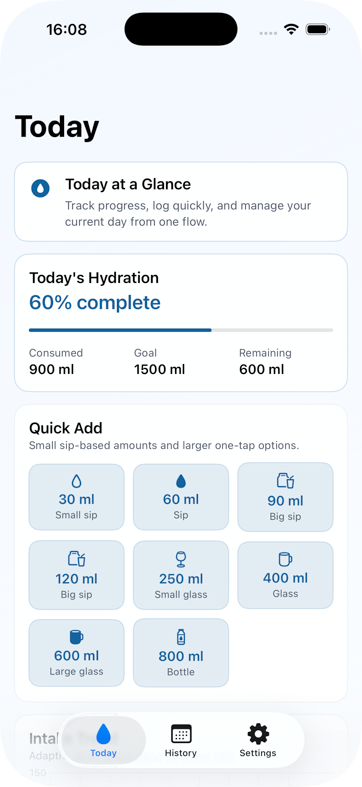
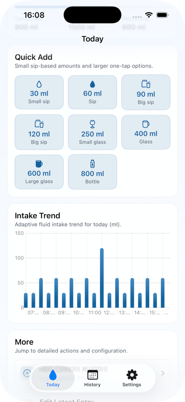
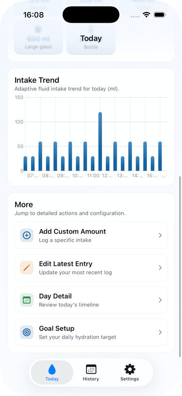
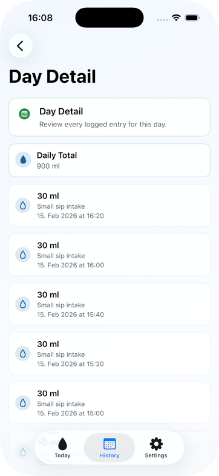
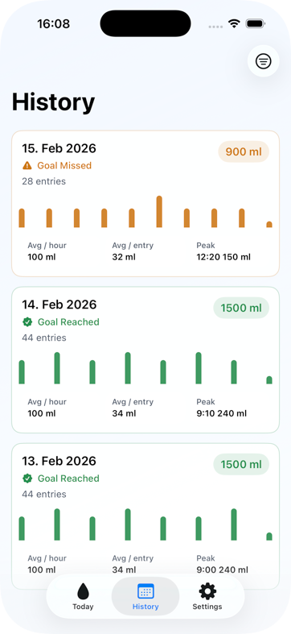
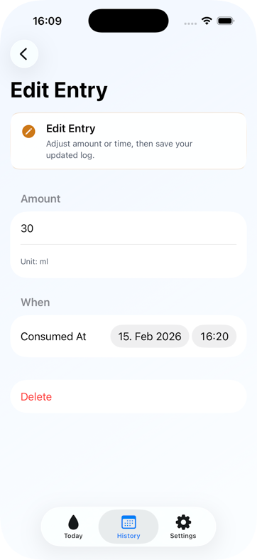
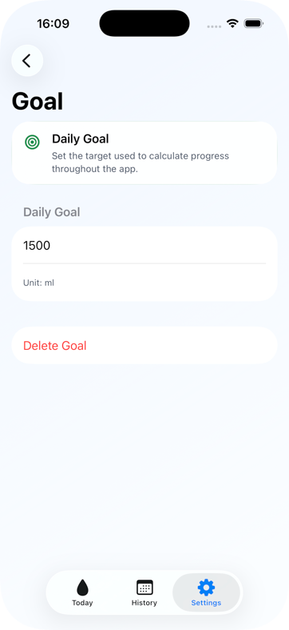
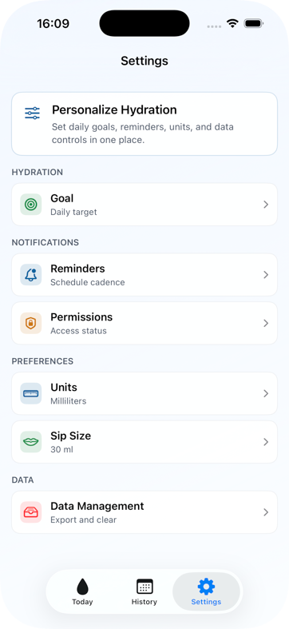

# SimpleHydrationTracker

SimpleHydrationTracker is an open-source SwiftUI sample designed as a practical architecture baseline for real iOS projects.

This repository is intentionally structured to help junior developers learn:

- how to separate responsibilities clearly
- how to keep features scalable as the app grows
- how to make code testable through protocol-driven boundaries

PRs are very welcome to improve and evolve this base project.

## License Notice

This project is licensed under the **GNU GENERAL PUBLIC LICENSE, Version 3, 29 June 2007 (GPL-3.0)**.

If you use, modify, or distribute this project (or derivative work), you must follow the GPLv3 license terms, including keeping derivative distributions open source under GPL-compatible terms.

## Screenshots










## Project Intent

- Provide a clean SwiftUI architecture baseline for learning and team adoption.
- Demonstrate feature-first organization with explicit boundaries.
- Keep navigation predictable through scene-owned routes.
- Encourage protocol-first dependency injection for testability.
- Show concurrency-safe state and persistence patterns with actors + AsyncStream.

## Tech Stack

- Swift 6
- SwiftUI
- Actor-backed stores
- Async/await + AsyncStream
- File-system JSON persistence in app Documents directory
- Xcode project structure (no custom tooling required)

## Current Structure

```text
SimpleHydrationTracker/
  Models/                    # Shared domain models (watch-shareable)
  SimpleHydrationTracker/
    Components/              # App-level reusable components
    Features/
      Today/
      History/
      Settings/
    Protocols/               # Service/store contracts and DI boundaries
    Scenes/                  # Navigation roots and route destinations
    Services/                # Orchestration + preference services
    Stores/                  # Actor-backed persistence stores
    Theme/                   # App-wide design tokens/theme values
    Views/                   # App launch/supporting views
  Screenshots/               # README screenshots
```

## Architecture Overview

### 1. Scene-Owned Navigation

Top-level scenes own navigation stacks and destinations:

- `TodayScene`
- `HistoryScene`
- `SettingsScene`

Routes are `Hashable` values, and each scene resolves its own route destinations.

### 2. View / ViewModel Separation

Views focus on rendering and user input.
View models focus on state projection, async workflows, and error handling.

This keeps UI code simple and business logic testable.

### 3. Service and Store Boundaries

- Services expose feature-safe APIs through protocols.
- Stores own persistence concerns and mutation serialization.
- Actor-backed stores publish updates through `AsyncStream`.

This pattern improves safety under concurrency and keeps data flow consistent.

### 4. Shared Models Framework

All shared domain models live in `Models/` and are designed for cross-target reuse.
This keeps future watch integration paths clean and predictable.

## Data Flow

1. User interacts with a View/Component.
2. View forwards intent to ViewModel.
3. ViewModel calls protocol-backed Service APIs.
4. Services coordinate Store operations.
5. Stores persist and publish updates through AsyncStream.
6. ViewModels react and publish new UI state.
7. SwiftUI re-renders.

## Why This Is Good for Junior Developers

- Clear folder boundaries reduce ambiguity.
- Protocol-first APIs make dependencies explicit.
- Scene navigation pattern prevents scattered route logic.
- Store/Service separation teaches scalability early.
- AsyncStream + actor usage demonstrates modern Swift concurrency patterns.

## Build

```bash
xcodebuild -project SimpleHydrationTracker.xcodeproj -scheme SimpleHydrationTracker -destination 'platform=iOS Simulator,name=iPhone 17 Pro' build
```

## Contributing

PRs are very welcome, especially improvements that strengthen:

- architecture clarity
- scalability and maintainability
- testability and dependency boundaries
- developer onboarding quality for juniors

Recommended contribution flow:

1. Fork the repository.
2. Create a focused branch.
3. Keep architecture boundaries intact.
4. Submit a PR with clear rationale and validation notes.

Small, focused PRs are preferred.

## Audience

This project is a strong base for:

- junior iOS developers learning architecture fundamentals
- teams wanting a production-minded SwiftUI starter structure
- engineers practicing protocol-driven, testable app design
